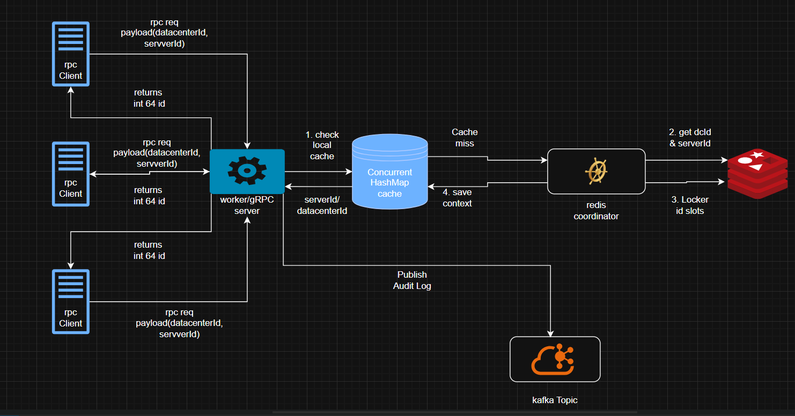
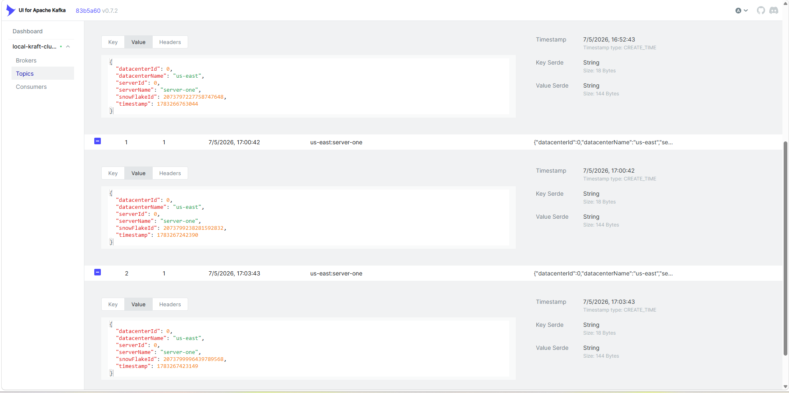

# Distributed Snowflake ID Generator

A production-grade distributed unique ID generator based on the Twitter Snowflake algorithm built with **Spring Boot** and **gRPC** that serves as a highly concurrent, collision-free identification system for a microservice architecture. The system retrieves dynamic Datacenter and Worker IDs on the fly using **Redis** for distributed coordination and caches them locally using a **ConcurrentHashMap** to provide high-throughput, sub-millisecond ID generation, while asynchronously publishing audit logs to **Apache Kafka**.

---

# Table of Contents

- [Overview](#overview)
- [Features](#features)
- [Architecture](#architecture)
- [Technology Stack](#technology-stack)
- [Configuration](#configuration)
    - [Static Datacenter Mapping](#static-datacenter-mapping)
    - [Application Configuration](#application-configuration)
- [Dynamic ID Generation](#dynamic-id-generation)
- [Worker Lease Lookup](#worker-lease-lookup)
- [Building the Project](#building-the-project)

---

# Overview

This ID generator is designed for cloud-native microservice environments where worker slots and datacenter mappings can be managed centrally without requiring hardcoded application redeployments.

Configuration and distributed state are externalized through **Redis**, allowing the fleet of ID generators to safely negotiate and lease worker slots (0-31) dynamically.

To minimize request latency, the generator caches established worker leases using a **ConcurrentHashMap**, enabling instant, memory-speed ID generation after the initial network negotiation.

---

# Features

- Thread-safe, non-blocking ID generation using Java synchronization
- High-performance communication with gRPC and Protobuf
- Externalized state and slot leasing using Spring Data Redis
- Dynamic, on-the-fly worker ID allocation via TTL-based Redis locks
- Asynchronous audit logging and metrics via Apache Kafka

---

# Architecture


---

# Technology Stack


| Component | Technology                 |
|-----------|----------------------------|
| Language | Java 21                    |
| Framework | Spring Boot 4.x            |
| RPC Framework | gRPC / Protobuf            |
| Caching & Locks | Redis (Spring Data Redis)  |
| Message Broker | Apache Kafka (Spring Kafka) |
| Algorithm | Twitter Snowflake          |
| Build Tool | Maven                      |

---

# Configuration

## Static Datacenter Mapping

Datacenter regions and server names are mapped to strict numeric IDs (0-31) and seeded into a centralized Redis hash upon startup.

**Redis Hash Structure (`snowflake:datacenter`)**

```json
{
  "EU_CENTRAL_1": 0,
  "US_EAST_1": 1,
  "AP_SOUTHEAST_1": 2
}
```

```json
{
  "ProductService": 0,
  "AuthService": 1,
  "EmailService": 2
}
```

Each key represents a logical cloud region, while the value defines the bitwise datacenter ID injected into the final Snowflake ID.
Each datacenter can be be mapped to at most 32 services 

---

# Dynamic ID Generation

## Algorithm Overview

This project implements the **Twitter Snowflake** algorithm, which relies on a divide-and-conquer strategy to generate distributed, time-sortable 64-bit unique IDs.

The 64-bit layout is divided into five distinct sections:

* **1-bit Sign Bit:** Always `0`. Reserved for future use (e.g., distinguishing signed from unsigned numbers).
* **41-bit Timestamp:** Milliseconds elapsed since a custom epoch. This guarantees that IDs are naturally sortable by time. A 41-bit allocation supports roughly 69 years of ID generation before requiring a new epoch.
* **5-bit Datacenter ID:** Fixed at startup. Supports up to 32 (2⁵) distinct datacenters or cloud regions.
* **5-bit Machine ID:** Fixed at startup. Supports up to 32 (2⁵) individual worker instances per datacenter.
* **12-bit Sequence Number:** Calculated at runtime. A local counter that increments for every ID generated on a machine within the same millisecond. It resets to `0` every millisecond, supporting a theoretical maximum throughput of 4,096 (2¹²) IDs per millisecond, per machine.

IDs are generated programmatically using a dedicated IdGenerationEngine (which uses the twitter snow flake approach) instantiated dynamically for each requesting service.

This provides:

- Zero-collision guarantees across distributed instances

- Type-safe gRPC request handling

- Centralized audit logging per request

- Direct association between specific microservices and their generated IDs

# Worker Lease Lookup

The node coordinator resolves dynamic worker leases through a dedicated lookup utility backed by a ConcurrentHashMap.

Lookup flow:

1. Extract the target datacenter and server name from the gRPC request.

2. Build a local cache key using the server name.

3. Attempt to retrieve the WorkerContext from the local cache.

4. On cache miss:

    - Retrieve the Datacenter ID from the static Redis hash.

    - Execute a 32-slot iteration to acquire a SET NX TTL lock in Redis.

    - Instantiate a new IdWorker with the acquired slot.

    - Store the resulting context in the ConcurrentHashMap.

5. Return the resolved context.

# Building the Project
**1. Get the Source Code**
You can download the zip file or clone the project repository:
```bash
git clone [https://github.com/Adagedo/twitter-snow-flake-distributer-id-generator.git](https://github.com/Adagedo/twitter-snow-flake-distributer-id-generator.git)
```

**2. Navigate to the Root Directory**
```bash
cd twitter-snow-flake-distributer-id-generator
```

**3. Build the Engine / gRPC Server**
Navigate into the engine module and run the Maven build:
```bash
cd distributed-id-generator-twitter-snow-flake
mvn clean install
```

**4. Build the Additional Server Module**
To get the most from this project, return to the root directory and build the secondary server component named server, and server-two.
The server module contains a ready to use project connected to a SQL database to that showcases the use of the twitter snowFlake id, While the server is just a simple controller that returns the snow flake if from the rpc server.
```bash
cd ../server
mvn clean install
```

# Audit Result



For each id generated by the engine or worker, audits data are sent to Kafka topics ready to be consumed by an auditing service, if any.
For the sake of this implementation of this project, no consumer for audit consuming.
        
